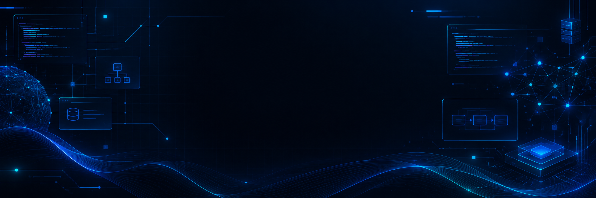

<div align="center">



<br><br>

# RAGHAV SINGLA

### AI SYSTEMS • APPLIED AI • SOFTWARE ENGINEERING


<br>

[](https://github.com/raghav26csu310-create)
[](https://github.com/raghav26csu310-create)
[](https://www.python.org/)
[](https://en.wikipedia.org/wiki/C_(programming_language))

</div>

---

## 👋 ABOUT ME

I'm a **B.Tech Computer Science student** exploring the intersection of
**Artificial Intelligence, software engineering and intelligent systems**.

I enjoy taking an idea, experimenting with technology, understanding how
the pieces work together, and turning it into something that actually runs.

```text
LEARN  →  EXPERIMENT  →  BUILD  →  BREAK  →  UNDERSTAND  →  IMPROVE
🔭 Currently Exploring
Generative AI & LLMs
AI Assistants
Voice AI
AI Agents
Natural Language Processing
AI-powered applications
Software engineering
⚡ WHAT I'M BUILDING
🎙️ Voice AI Assistant

A real-time voice assistant experiment built around a local AI stack.

Pipeline

Voice Input → VAD → Speech Recognition → Local LLM → Web Search → Speech

Stack

Python Faster-Whisper Silero VAD Ollama Piper

Exploring how individual AI components can be combined into a complete
working intelligent system.

🌦️ WeatherGPT

An AI-powered weather intelligence concept designed to make weather
information easier to understand and interact with.

AI Weather Intelligence Natural Language UX

🏥 Patient Case-Taking AI

A conversational AI experiment focused on collecting and structuring
patient case information.

AI NLP Conversational AI Healthcare

💻 C Programming

My programming foundation — coursework, practice programs,
problem solving and experiments in C.

C Programming Problem Solving

🧠 TECHNOLOGY
<div align="center">
LANGUAGES


<br><br>

AI • DEVELOPMENT


<br><br>

Ollama • Faster-Whisper • Silero VAD • Piper

</div>
🎯 CURRENT MISSION
PROJECT ASCEND — LEVEL 01
AREA	STATUS
🎓 B.Tech CSE	🟢 ACTIVE
⚙️ C Programming	🟢 ACTIVE
🐍 Python	🟡 LEARNING
🤖 Generative AI	🟢 EXPLORING
🎙️ Voice AI	🟢 BUILDING
🧠 Machine Learning	🟡 EXPLORING
🌐 AI Agents	🟡 EXPLORING
💻 DSA	⚪ UPCOMING
🚀 Production AI Systems	⚪ FUTURE
Mission Objectives
 Start B.Tech
 Build programming foundations
 Start building real projects
 Explore Generative AI
 Build an AI assistant
 Strengthen Python
 Master DSA
 Deepen Machine Learning
 Build larger AI systems
 Explore AI Agents
 Contribute to Open Source
 Build production-grade AI products
📈 THE JOURNEY
             🎓 STUDENT
                 │
                 ▼
            💻 DEVELOPER
                 │
                 ▼
             🤖 AI BUILDER
                 │
                 ▼
        ⚙️ AI SYSTEMS ENGINEER
                 │
                 ▼
         🧠 APPLIED AI ENGINEER
                 │
                 ▼
          🚀 TECHNOLOGY LEADER

I'm interested in the point where AI stops being just a demo
and becomes a real system.

🛠️ MY APPROACH

Don't just use the technology. Understand it.

I prefer learning through projects:

Idea → Prototype → Experiment → Break → Debug → Understand → Improve

Every project is an opportunity to understand something I didn't know before.

🌌 AREAS I'M MOVING TOWARDS

ARTIFICIAL INTELLIGENCE

GENERATIVE AI

AI SYSTEMS

LLMs

AI AGENTS

VOICE AI

SOFTWARE ENGINEERING

AI PRODUCTS

<div align="center">
⚡ LEARN • BUILD • UNDERSTAND • EVOLVE
<br>

BUILDING TODAY. ENGINEERING TOMORROW.

<br><br>


<br><br>

RAGHAV SINGLA

</div> ```
